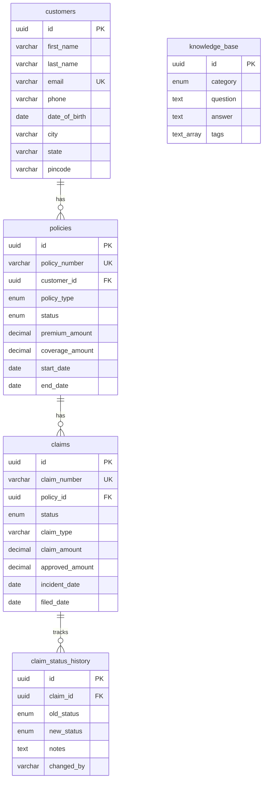

# 🛡️ Insurance Policy Agent

An AI-powered agent that handles **Claims Status**, **Policy Information**, and **General Knowledge Base** queries for an insurance company. Built with Supabase as the backend database.

## 🚀 Features

| Feature | Description |
|---------|-------------|
| **Claims Status** | Look up claim details, track status changes, view full audit history |
| **Policy Information** | Retrieve policy details, coverage, premiums, and validity |
| **Knowledge Base** | Search FAQ articles across claims, billing, coverage, and general topics |
| **Customer Lookup** | Find customer details by email, phone, or ID |

---

## 📊 Database Schema



---

## 🛠️ Setup

### Prerequisites

- Python 3.10+
- Supabase project (or self-hosted Supabase)

### 1. Clone & Install

```bash
cd policy-agent
pip install -r requirements.txt
```

### 2. Configure Environment

Copy `.env.example` to `.env` and fill in your credentials:

```bash
cp .env.example .env
```

### 3. Run Database Migrations

You can run the SQL migrations via the **Supabase SQL Editor** or using `psql`:

```bash
# Via psql
psql "$DATABASE_URL" -f supabase/migrations/001_create_tables.sql
psql "$DATABASE_URL" -f supabase/migrations/002_seed_data.sql
```

Or paste the contents of each file into the **Supabase Dashboard → SQL Editor**.

---

## 📁 Project Structure

```
policy-agent/
├── .env                          # Environment variables (secrets)
├── .env.example                  # Template for .env
├── README.md                     # This file
├── requirements.txt              # Python dependencies
├── docs/
│   ├── database_schema.md        # Detailed database documentation
│   └── agent_tools.md            # Agent tool specifications
└── supabase/
    └── migrations/
        ├── 001_create_tables.sql # Schema DDL
        └── 002_seed_data.sql     # Sample seed data
```

---

## 📋 Sample Queries

### Check a claim status
```sql
SELECT c.claim_number, c.status, c.claim_amount, c.approved_amount,
       c.description, c.incident_date, c.filed_date
FROM claims c
WHERE c.claim_number = 'CLM-2024-0001';
```

### Get a customer's policies
```sql
SELECT p.policy_number, p.policy_type, p.status,
       p.premium_amount, p.coverage_amount, p.start_date, p.end_date
FROM policies p
JOIN customers cu ON p.customer_id = cu.id
WHERE cu.email = 'rajesh.sharma@email.com';
```

### Search knowledge base
```sql
SELECT question, answer, category
FROM knowledge_base
WHERE 'claim' = ANY(tags)
  AND is_published = true;
```

---

## 📄 Documentation

- [Database Schema Details](docs/database_schema.md) — Complete table definitions, enums, and relationships
- [Agent Tools Specification](docs/agent_tools.md) — Tool functions the agent uses to query data

---

## 📌 Sample Data Summary

| Entity | Count | Details |
|--------|-------|---------|
| Customers | 5 | Indian names and addresses |
| Policies | 8 | health, auto, home, life, travel |
| Claims | 10 | Various statuses (submitted → paid) |
| Status History | 22 | Full audit trails |
| KB Articles | 17 | Across 5 categories |

---

## 🔗 Environment Variables

| Variable | Description |
|----------|-------------|
| `DATABASE_URL` | Supabase PostgreSQL connection string |
| `OPENAI_API_KEY` | OpenAI API key (for GPT-powered agent) |
| `DEEPSEEK_API_KEY` | DeepSeek API key (alternative LLM) |
| `DEEPSEEK_API_BASE` | DeepSeek API base URL |
| `RATE_LIMIT` | API rate limit configuration |
